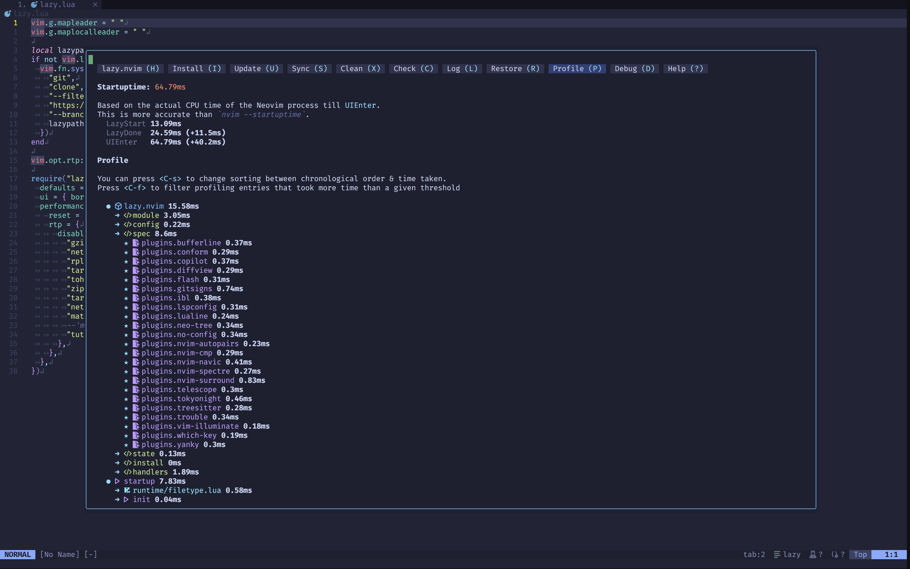

### Neovim

(Shot on [Wezterm](https://github.com/wez/wezterm), FiraMono Nerd Font, [Tokyo Night - Moon](https://github.com/folke/tokyonight.nvim) colorscheme.)

Kickstart with [kickstart.nvim](https://github.com/nvim-lua/kickstart.nvim) and additional plugins.

- [bufferline.nvim](https://github.com/akinsho/bufferline.nvim)
- [diffview.nvim](https://github.com/sindrets/diffview.nvim)
- [flash.nvim](https://github.com/folke/flash.nvim)
- [mini.bufremove](https://github.com/echasnovski/mini.bufremove)
- [neo-tree.nvim](https://github.com/nvim-neo-tree/neo-tree.nvim)
- [nvim-navic](https://github.com/SmiteshP/nvim-navic)
- [nvim-autopairs](https://github.com/windwp/nvim-autopairs)
- [nvim-ts-autotag](https://github.com/windwp/nvim-ts-autotag)
- [nvim-spectre](https://github.com/nvim-pack/nvim-spectre)
- [nvim-surround](https://github.com/kylechui/nvim-surround)
- [oil.nvim](https://github.com/stevearc/oil.nvim)
- [trouble.nvim](https://github.com/folke/trouble.nvim)
- [vim-illuminate](https://github.com/RRethy/vim-illuminate)
- [yanky.nvim](https://github.com/gbprod/yanky.nvim)

### Fish

- [oh-my-fish](https://github.com/oh-my-fish/oh-my-fish) (alt [Tide](https://github.com/IlanCosman/tide))
- [fisher](https://github.com/jorgebucaran/fisher)
- [z](https://github.com/jethrokuan/z)
- [eza](https://github.com/eza-community/eza)
- [fzf](https://github.com/junegunn/fzf)
- [rg](https://github.com/BurntSushi/ripgrep)
- [fd](https://github.com/sharkdp/fd)
