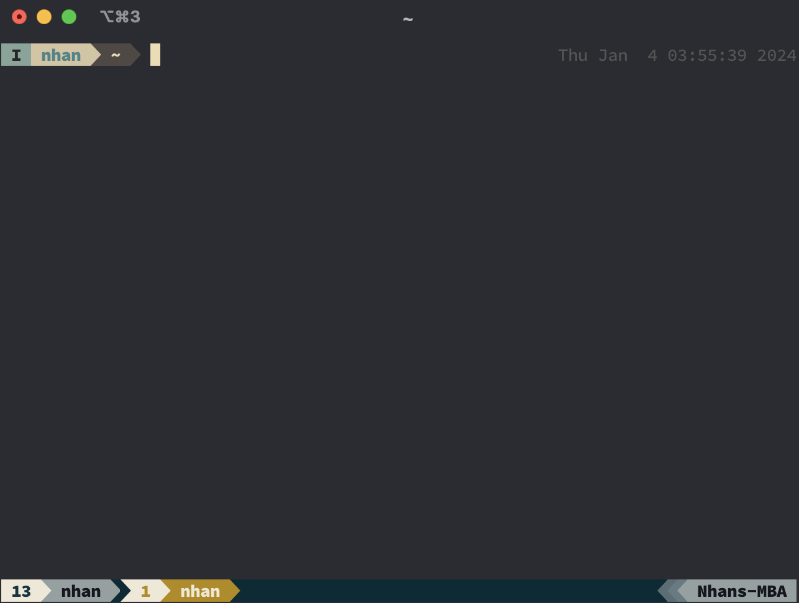

## fish shell

- **Oh-my-fish:** framework
- **Fisher:** plugin manager for fish
- **z:** directory jumping
- **bobthefish or default:** theme
- **eza:** replacement for ls command (exa is unmaintained)
- **fzf:** fuzzy find to find files/folders

## kitty terminal

- migrate from iterm2 because of weird underline highlighting (ibl nvim plugin). If using kitty with tmux, same thing happens. But kitty has built in panes so no need to use tmux.

## nvim

use kickstart.nvim as starting point with some plugins.

- **nvim-web-devicons**
- **nvim-autopairs**
- **rainbow-delimiters**
- **indent-blankline**
- **lualine**

## nerd fonts

- **SauceCodePro**
- **MesloLGS**

## terminal should look like this after configuration (iterm2 terminal)

